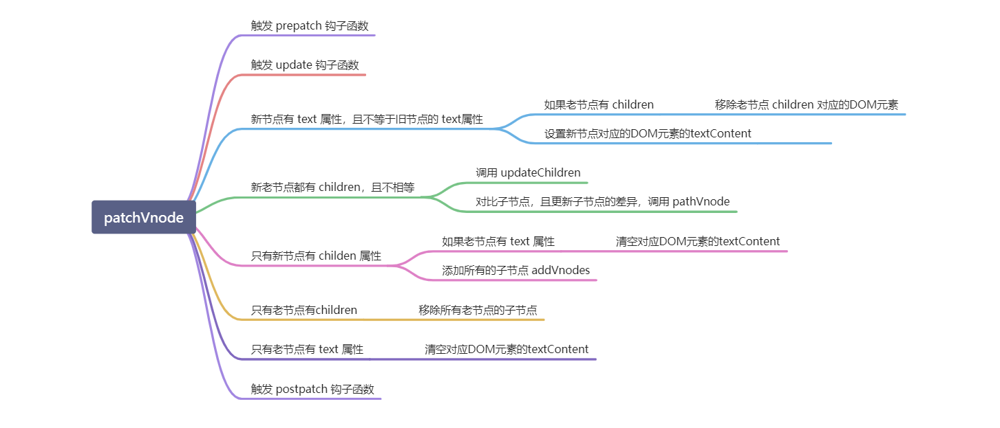
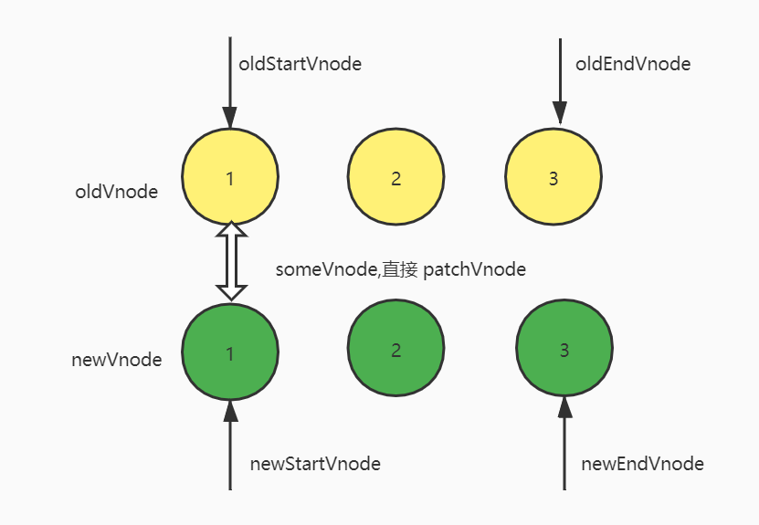
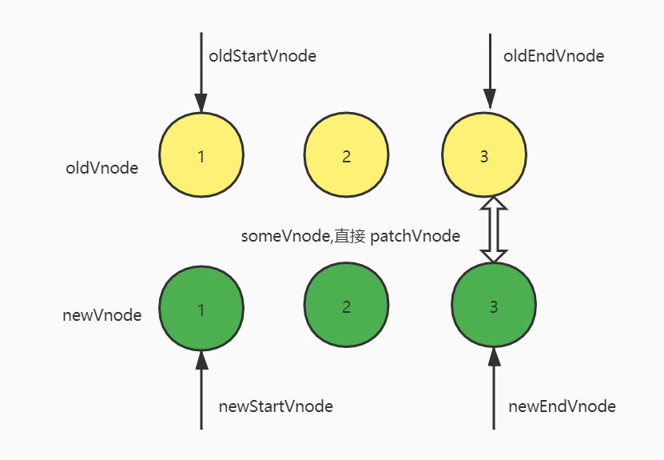
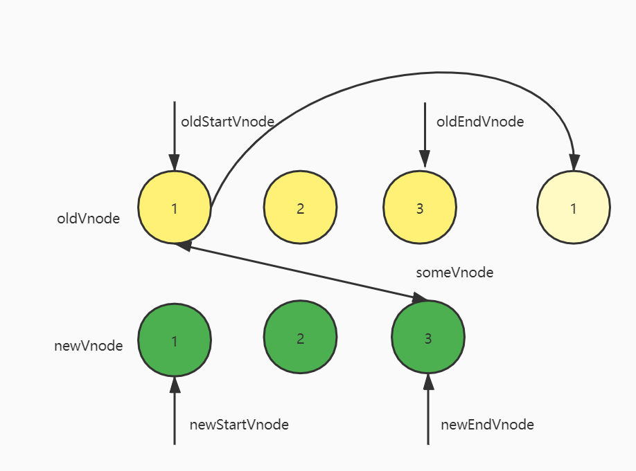
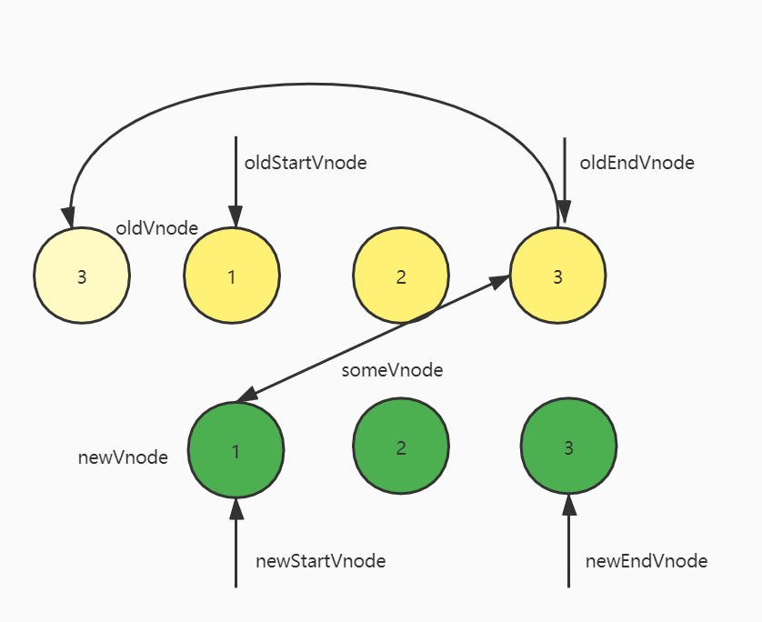
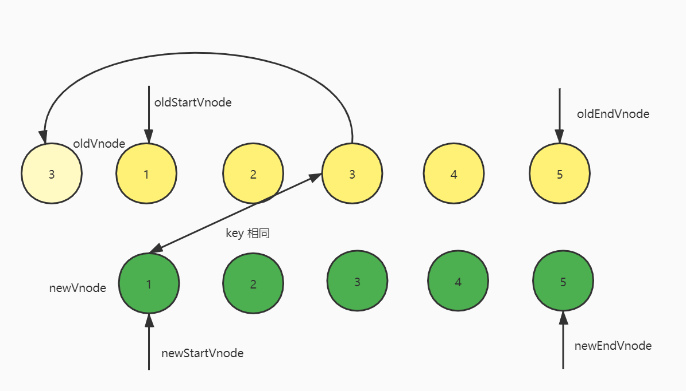

## 一、简答题

### 1、当我们点击按钮的时候动态给 data 增加的成员是否是响应式数据，如果不是的话，如何把新增成员设置成响应式数据，它的内部原理是什么。

```js
let vm = new Vue({
 el: '#el'
 data: {
  o: 'object',
  dog: {}
 },
 method: {
  clickHandler () {
   // 该 name 属性是否是响应式的
   this.dog.name = 'Trump'
  }
 }
})
```
点击按钮时给 data 添加的成员不是响应式的，要想把新添加的成员设置成响应式数据，就需要调用 vue 的 vm.$set 方法。设置如下
```angular2html
...
vm.$set(this.dog, 'name', 'Trump')
```
Vue 当中有个 observer 对象负责劫持数据，当调用 vm.$set 时，会触发 observer 对象的方法为添加的属性设置 getter 和 setter。在设置 getter 的时候，会有一个 dep 对象来收集该属性对应的依赖，然后，把这些依赖一一保存起来。这些依赖就是 watcher, watcher 当中有个 update 事件更新视图。当我们修改这个属性的数据时，会触发 setter ，而在 setter 当中会触发 dep 的 notify 事件，该事件会通知 watcher 去更新 dep 所收集的所有的依赖的视图。也就是触发 watcher 的 update 事件。
 　

　

　


### 2、请简述 Diff 算法的执行过程
diff 算法在执行的过程中会记住老节点的开始索引、老节点的开始节点、老节点的结束索引、老节点；新节点的开始索引、新节点的开始节点、新节点的结束索引、新节点的结束节点。然后，开始循环比较，比较的情况有下面的几种：
1. 比较老节点和新节点的开始节点是否是同一个节点，通过调用 sameVnode 来比较两个节点的 sel 和 key 是否相同，如果相同，则调用 patchVnode 来更新节点。更新的方法如下:<br />
   > <br />
   >
   然后，老节点的开始索引和新节点的开始索引 ++ 同时，老节点的开始节点和新节点的开始节点往后移一位。如果，老节点的开始节点和新节点的开始节点不相等，判断老节点和新节点的结束节点是否是同一个相同。
   >
2. 比较老节点和新节点的结束节点是否相同。同样调用 sameVnode 判断。如果相同，调用 patchVnode 来更新节点，然后老节点的结束节点和新节点的结束节点分别往前移一位，同时，老节点的结束索引和新节点的结束索引分别减1。如果老节点的结束节点和新节点的结束节点不相同，走下一个判断。
   >
3. 比较老节点的开始节点和新节点的结束节点是否相同。调用 sameVnode 判断。如果相同，调用 patchVnode 来更新节点，并且把老节点的开始节点对应的 DOM 元素移到当前老节点的结束节点对应的 DOM 元素的后面。通过调用 insertBefore 实现。然后，老节点的开始节点往后移一位，老节点的开始节点的索引加1，新节点的结束节点往前移一位，新节点的结束节点的索引减1。如果老节点的开始节点和新节点的结束节点不相同，则走下一个判断。判断老节点的结束节点和新节点的开始节点是否相同。
   >
4. 比较老节点的结束节点和新节点的开始节点是否相同。同样，调用 sameVmode 判断。如果相同，调用 patchVnode 更新节点，并且把老节点的结束节点对应的 DOM元素移到当前老节点的开始节点对应的 DOM 元素的前面。通过调用 insertBefore 实现。然后,老节点的结束节点往前移一位，老节点的结束索引减1,新节点的开始节点往后移一位，新节点的开始索引加1。如果这个判断还不符合，还有最后一种判断。
   >
5. 这个是比较 key 的。先遍历老节点，把所有的老节点的 key 和对应的老节点的 index 组成一个对象，其中，对象的 key 是老节点的 key，对象的 value 是老节点的 index。然后，用当前新节点的 key 去老节点的 key 的对象当中寻找，如果没找到索引，则说明当前的新节点是新的节点，需要重新生成 DOM 元素，然后，插入到当前老节点对应的 DOM 元素前面。如果，找到了，就通过对应的索引把老节点赋值给 elmToMove ,接着再判断新节点和 elmToMove 的 sel，是否相同，如果相同，调用 pathVnode 更新节点，且把 elmToMove 对应的 DOM 元素移动到当前老节点的开始节点对应的 DOM 元素前面。如果 sel 不相等，则当前的 vnode 是新的，需要创建 DOM元素，在添加到 DOM 树上。
 >

经过上的的循环判断之后，还会有两种情况需要额外的处理的：一种是，新节点先遍历完，老节点还剩余的节点，此时 oldStartIdx > oldSEndIdx 会删除剩余的老节点；另一种是，老节点先遍历完，新节点还有剩余的，此时 newStartIdx < newEndIdx，会把剩余的新节点添加到 DOM 上。

　

　


 

## 二、编程题

### 1、模拟 VueRouter 的 hash 模式的实现，实现思路和 History 模式类似，把 URL 中的 # 后面的内容作为路由的地址，可以通过 hashchange 事件监听路由地址的变化。

 　

　

### 2、在模拟 Vue.js 响应式源码的基础上实现 v-html 指令，以及 v-on 指令。

 　

　

### 3、参考 Snabbdom 提供的电影列表的示例，利用Snabbdom 实现类似的效果，如图：


### 学习笔记链接
> https://www.yuque.com/docs/share/ec75b48c-c1e5-436e-b482-c004627a1b56?# 《Virtual DOM 和 diff 算法》
> 
>https://www.yuque.com/docs/share/1d5556a2-8bc7-4913-9676-e9cc34b28b16?# 《手写 mini-vue 实现》
> 
> https://www.yuque.com/docs/share/2ba54ad2-2981-4bb3-8328-b58cd7ab376f?# 《发布/订阅模式和观察者模式》
> 
> https://www.yuque.com/docs/share/3c4ec44a-50a5-4aea-bf5f-0910c9994727?# 《Vue-Router 实现原理》
